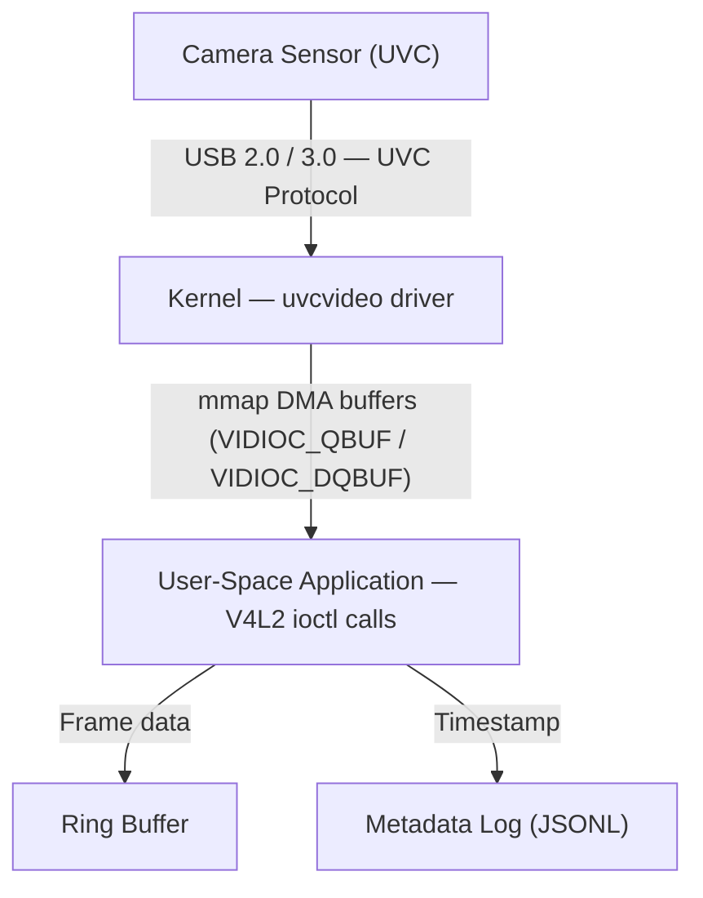

```mermaid
graph TD
    A["Camera Sensor (UVC)"] -->|"USB 2.0 / 3.0 — UVC Protocol"| B["Kernel — uvcvideo driver"]
    B -->|"mmap DMA buffers (VIDIOC_QBUF / VIDIOC_DQBUF)"| C["User-Space Application — V4L2 ioctl calls"]
    C -->|"Frame data"| D["Ring Buffer"]
    C -->|"Timestamp"| E["Metadata Log (JSONL)"]
```

